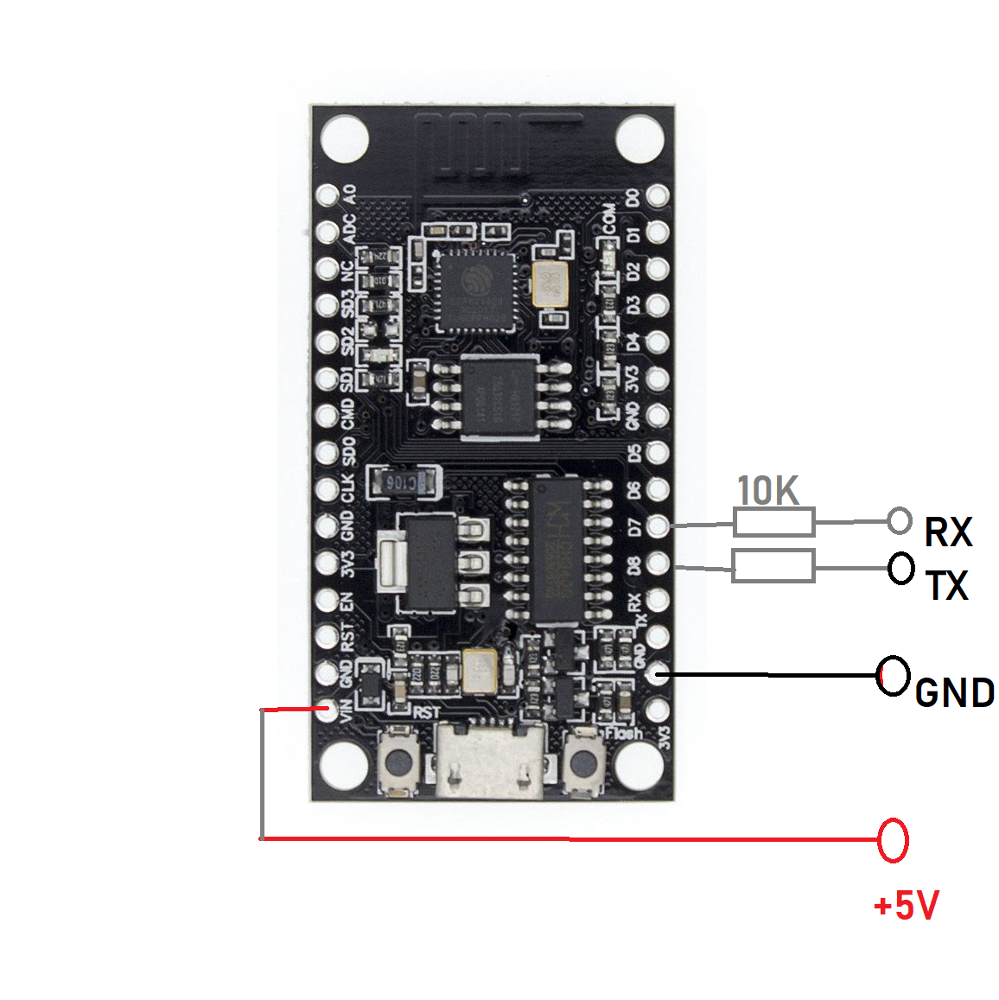
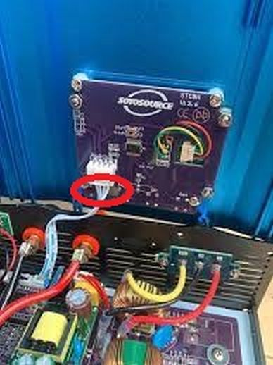
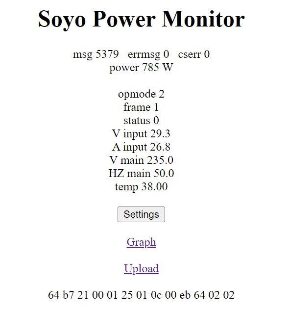

This is a work in progress.

Serial console tells you where to connect. And use your own wifi credentials, not mine.

Connect soyosource rx and tx via a 10kohm resistor to the esp8266 Tx = GPIO15, Rx = GPIO13.

This pins:

That cable:

I do not remember which cable pins are what signal, find it yourself. 

Should look like:

