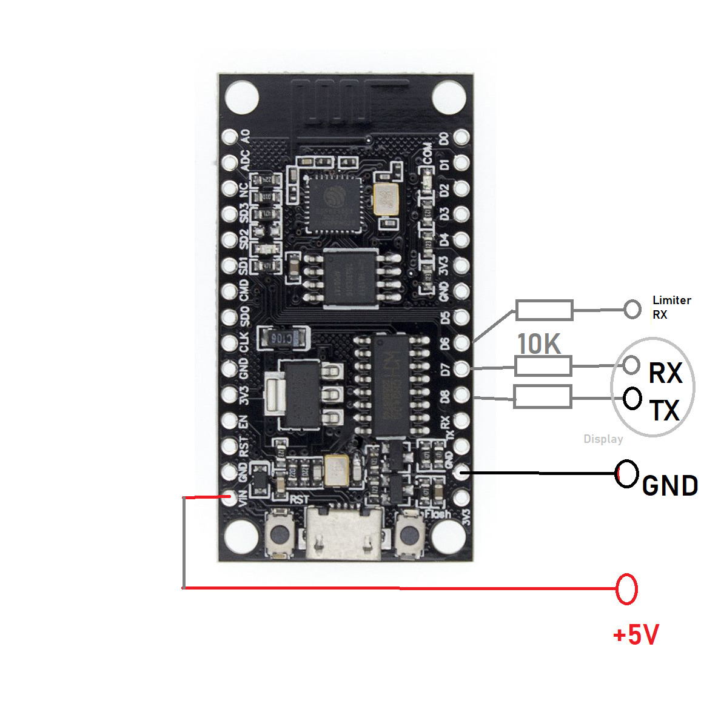
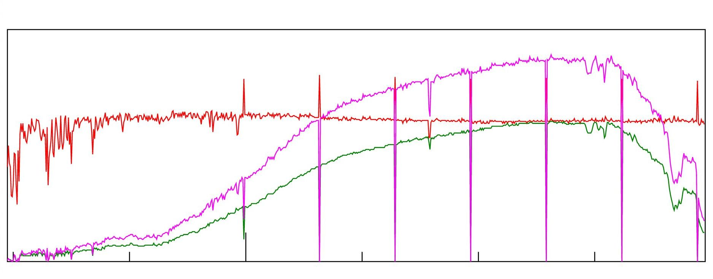

Soyosource-GridTie-inverter 1000W 24V LCD replacement
-----------------------------------------------------

This is a work in progress. Only for the 24V 1000W soyo inverter with LCD. The lcd-less type use other messages. Absolutely no liability. Your fuckups are your problem. DO NOT have the serial programming cable connected when the soyo is connected to the grid! Use the OTA "wifi upload" feature to change firmware.

Serial console tells you where to connect. Something like "http://192.168.178.67/" in your browser. And use your own wifi credentials, not mine.

Connect soyosource rx and tx via a 10kohm resistor to the esp8266 Tx = GPIO15, Rx = GPIO13. Or 1kohm, idk, its for adapting the esp 3.3V to the soyo 5V.

GPIO 12 will be used for limiter later. This will be softserial TX only at 4800 baud. Connection goes to RX where the RS485 board was installed, 5-pin socket, pins have white marking.

This pins:

That cable:

Pic of which cable pins are what signal. 

DO NOT TRUST IT! Measure 5V and Gnd yourself! Especially Rx/Tx may well be swapped.

This is another temporary hookup which then became permanent.

Main screen:

Settings screen, press "read values" to see:

Graph screen, red=volt, green=amps, magenta=power:

This is the limiter connection pin:

Good luck. If you find improvements please notify.

Do not use "Bat power" setting for dynamic adjustments, this will fuck up your eeprom. There might be a special message for dynamic power setting but i have not tested that. 
